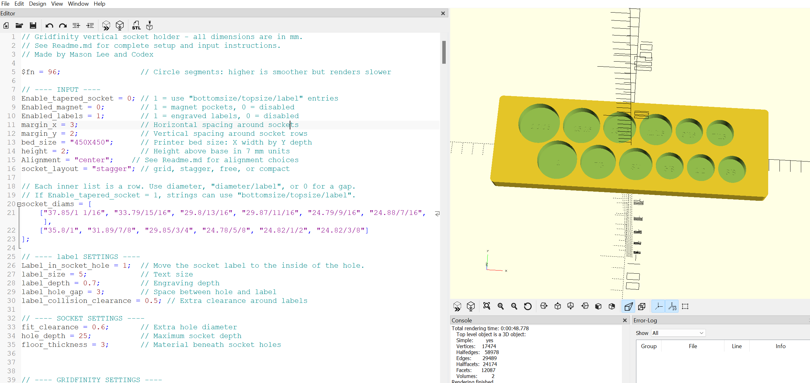
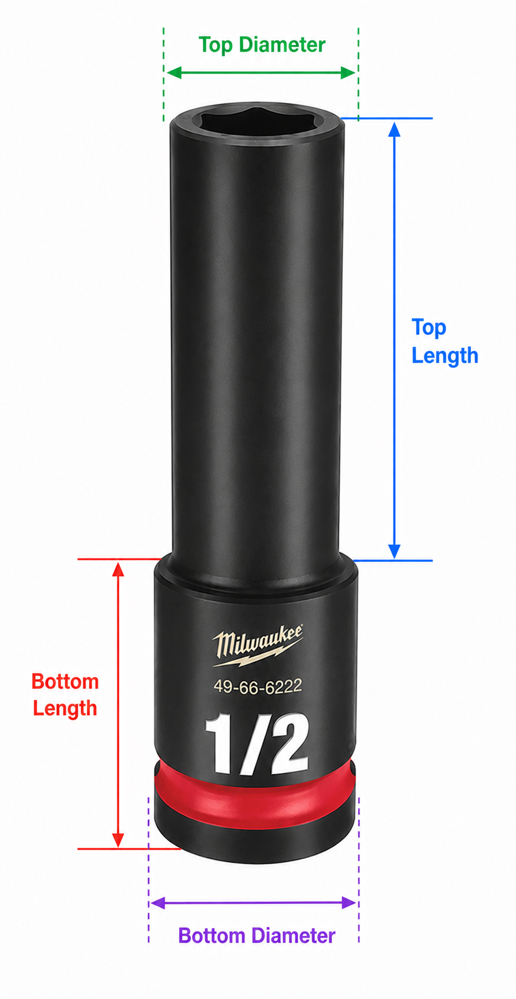

# Gridfinity Socket Holder Generators



A pair of customizable OpenSCAD generators for vertical and horizontal Gridfinity socket holders.


## Requirements
- [OpenSCAD](https://openscad.org/)
- Calipers for measuring socket diameter and length

> Note: I hope it will get hosted somewhere for everyone to use.

## Quick start
1. Measure the sockets that you want to create a holder for.
2. Open `Vertical_Socket_generator.scad` or `Horizontal_Socket_generator.scad` in OpenSCAD.
3. Adjust the settings near the top of the file.
4. Replace the example `socket_diams` rows with your socket measurements.
5. Select **File > Export > Export as STL**.

> Note: All measurements in the generator are millimeters.

## How To Measure Sockets
<details>
<summary>Click to expand</summary>

I have add a template CSV fie for people to use to measure their sockets. 
> Note: you have to use `\` instead of `/` as excel or google sheet will treat the fraction as a date or some other format. 



Use calipers and measure in millimeters. Measure the widest outside diameter of the part of the socket that will sit in the holder, not the wrench drive opening.

### For the vertical generator:


1. Measure the socket's outside diameter near the end that goes into the hole.
2. If the socket is tapered, measure both the smaller bottom diameter and the larger top diameter.
3. Use `"diameter/label"` for straight sockets, such as `"19.86/14mm"`.
4. Use `"bottomsize/topsize/label"` for tapered sockets when `Enable_tapered_socket = 1`, such as `"33.5/36/36mm"`.

> Note: For vertical tapered sockets, `bottomsize` is used for the hole diameter. `topsize` is used for layout spacing. Increase `height` or `hole_depth` if the socket needs to sit deeper.

### For the horizontal generator:

1. Measure the socket's outside diameter.
2. Measure the full socket length from end to end.
3. Use `"diameter/length/label"`, such as `"19.86/38/14mm"`.
4. For tapered sockets, measure the bottom diameter, bottom length, top diameter, and top length.
5. Use `"bottom_diameter/bottom_length/top_diameter/top_length/label"` when `Enable_tapered_socket = 1`, such as `"19.86/24/22.5/14/14mm"`.

> Note: If the transition between socket sections is rounded or hard to measure, add a few millimeters to the larger section length so the cradle has enough clearance.

Tips:

- Take a few measurements around the socket and use the largest value.
- If the socket rocks or binds, increase `fit_clearance` slightly.
- If the socket feels too loose, decrease `fit_clearance` slightly.
- Print a small test holder before making a full set.

</details>


## Vertical Socket Generator
<details>
<summary>Click to expand</summary>
`socket_diams` is a list of rows. Rows are placed from top to bottom, and entries within each row are placed from left to right.

```scad
socket_diams = [
    ["19.86/14mm", "17.86/13mm", "16.91/12mm"],
    [27.14, 24.78, 0],
    ["9.19/1/4", "11.1/3/8"]
];
```

- A number such as `27.14` creates a hole for a socket with a 27.14 mm outside diameter.
- A string such as `"19.86/14mm"` creates a 19.86 mm hole with the custom label `14mm`.
- Only the first slash separates the diameter and label, so `"9.19/1/4"` produces the fractional label `1/4`.
- Set `Enable_tapered_socket = 1` for tapered sockets and enter them as `"bottomsize/topsize/label"`, such as `"33.5/36/36mm"`. The socket hole stays straight using `bottomsize`; `topsize` is used for layout spacing.
- A `0` leaves an empty position, which is especially useful in the `grid` layout.
- Add another inner `[ ... ]` list, separated by a comma, to create another row.

</details>

## Horizontal Socket Generator

<details>
<summary>Click to expand</summary>
Open `Horizontal_Socket_generator.scad` to create a holder where sockets lie horizontally. Its normal input format includes both the outside diameter and complete socket length:

```scad
socket_diams = [
    ["19.86/38/14mm", "17.86/36/13mm"],
    ["12.5/50/1/4", 0]
];
```

The format is `"diameter/length/label"`. For example, `"19.86/38/14mm"` means a 19.86 mm diameter socket that is 38 mm long and labeled `14mm`. 

For tapered horizontal sockets, set `Enable_tapered_socket = 1` and use `"bottom_diameter/bottom_length/top_diameter/top_length/label"`:

```scad
socket_diams = [
    ["19.86/24/22.5/14/14mm", "17.86/23/20.2/13/13mm"]
];
```

This creates a two-section cradle: one section for the bottom diameter and length, and one section for the top diameter and length.

Sockets run front-to-back in shallow curved cradles. Adjust `recess_fraction` to change how deeply they sit; values above `0.5` are intentionally rejected to avoid trapping sockets in an undercut.

The horizontal generator supports `"grid"`, `"free"`, and `"compact"` layouts. Compact mode uses the actual cradle widths and lengths to pull rows closer together where adjacent cradles do not overlap.

</details>

## Main settings
<details>
<summary>Click to expand</summary>

### Features

```scad
Enable_tapered_socket = 0;
Enabled_magnet = 0;
Enabled_labels = 0;
```

Use `1` to enable a feature and `0` to disable it. Magnet pockets are added beneath every Gridfinity cell. Labels are engraved beside their matching holes or cradles.

Optional screw holes are controlled separately:

```scad
screw_holes = false;
```
</details>

### Spacing and height
<details>
<summary>Click to expand</summary>

```scad
margin_x = 2;
margin_y = 2;
bed_size = "250X250";
height = 2;
```

`margin_x` controls horizontal spacing between sockets and at the left and right holder edges. `margin_y` controls spacing between socket rows and at the top and bottom edges. Increasing either value can make the holder occupy more Gridfinity cells.

`bed_size` is the printer's usable X-by-Y area in millimeters. Enter it as `"250X250"`. The generator reports an error when the finished Gridfinity footprint is wider or deeper than this size.

`height` is the holder height above the 7 mm base, expressed in 7 mm units:

- `1` = 7 mm above the base
- `2` = 14 mm above the base - **Default**
- `3` = 21 mm above the base

In the vertical generator, when the holder is shorter than the requested `hole_depth`, the holes are shortened automatically to preserve `floor_thickness`.

</details>

### Alignment Settings
<details>
<summary>Click to expand</summary>

```scad
Alignment = "top_left";
```

Available positions are:

- `"top_left"`
- `"top_right"`
- `"center_left"`
- `"center"`
- `"center_right"`
- `"bottom_left"`
- `"bottom_right"`

Alignment positions the complete socket layout inside the Gridfinity-sized holder.

### Layout modes

```scad
socket_layout = "grid";
```

- `"grid"` gives every socket an equally sized position based on the largest socket. Use it for straight, evenly aligned rows and columns.

```text
Row 1:  O   O   O   O
Row 2:  O   O   O   O
Row 3:  O   O   O   O
Row 4:  O   O   O   O
```

- `"stagger"` is available in the vertical generator. It shifts every other row by half of the largest socket pitch and reduces row spacing where the sockets can nest without touching.

```text
Row 1:  O   O   O   O
Row 2:    O   O   O   O
Row 3:  O   O   O   O
Row 4:    O   O   O   O
```

- `"free"` uses each socket's actual width while retaining normal row spacing. Rows stay straight, but small sockets do not consume the same width as large sockets.

```text
Row 1:  O     O    O
Row 2:  O  O      O
Row 3:  O    O  O
```

- `"compact"` packs sockets and rows tightly and accounts for label clearance. This is usually the smallest layout when you want the generator to remove unused space.

```text
Row 1:  O     O    O
Row 2:  O  O      O
Row 3:   O    O  O
```
</details>

## Socket and label Settings
<details>
<summary>Click to expand</summary>

```scad
fit_clearance = 0.6;
hole_depth = 25;
floor_thickness = 3;

label_size = 5;
label_depth = 0.7;
Label_in_socket_hole = 0; // Vertical generator
label_rotation = 0; // Vertical labels and horizontal outside labels
Label_in_socket_cradle = 0; // Horizontal generator
label_cradle_rotation = 0; // Horizontal inside-cradle labels
label_cradle_scale = 0.75; // Horizontal inside-cradle label size
label_cradle_pocket_margin = 1; // Horizontal pocket extra size
label_cradle_pocket_depth = 1.2; // Horizontal flat label pocket
label_hole_gap = 3;    // Vertical generator
label_socket_gap = 3;  // Horizontal generator
label_collision_clearance = 0.5;
```

- Increase `fit_clearance` if sockets fit too tightly; decrease it if they are too loose.
- `hole_depth` is the maximum vertical socket insertion depth.
- `floor_thickness` is the solid material left beneath each socket.
- The label settings control text size, engraving depth, socket-to-label spacing, and label collision clearance.
- In the vertical generator, set `Label_in_socket_hole = 1` to engrave labels in the bottom of each socket hole instead of beside the hole.
- Use `label_rotation` in the vertical generator, or for horizontal labels outside the cradle, to rotate labels. `0`, `90`, `180`, and `270` degrees are layout-aware.
- In the horizontal generator, set `Label_in_socket_cradle = 1` to engrave labels in the bottom of each socket cradle instead of beside the cradle.
- Horizontal inside-cradle labels use a flat rectangular pocket controlled by `label_cradle_pocket_depth`. Set `label_cradle_rotation = 0` to run across the cradle, or `90` to run with the socket length.
- The flat pocket is `label_cradle_pocket_margin` larger than the largest rotated label in the holder.
- Use `label_cradle_scale` to make horizontal inside-cradle labels smaller or larger inside the flat pocket.
- When `Label_in_socket_hole = 1`, tiny socket holes automatically reduce the engraved text size so the label stays inside the hole. `label_size` is still the maximum text size.
- When `Label_in_socket_cradle = 1`, tiny socket cradles automatically reduce the engraved text size so the label stays inside the cradle. `label_size` is still the maximum text size.

Print a small test holder before generating a large set, since socket measurements and printer tolerances vary.
</details>

## Advanced Gridfinity Settings
<details>
<summary>Click to expand</summary>

These values normally do not need changing. They define the base profile and optional bottom holes used by both generators.

```scad
grid = 42;
base_h = 7;
base_profile_h = 4.75;
base_top = 41.5;
base_bottom = 35.6;
base_r_top = 3.75;
base_r_bottom = 0.8;

magnet_d = 6.2;
magnet_h = 2.2;
screw_holes = false;
screw_d = 3.2;
screw_h = 7;
hole_from_cell_edge = 8;
```

- `grid` is the 42 mm Gridfinity cell pitch.
- The base dimensions and radii define the tapered Gridfinity foot profile.
- `magnet_d` and `magnet_h` set the optional magnet-pocket size.
- Set `screw_holes` to `true` to add screw holes; `screw_d` and `screw_h` set their size.
- `hole_from_cell_edge` positions magnet and screw-hole centers inward from each cell edge.
</details>

## Render Quality Settings
<details>
<summary>Click to expand</summary>

```scad
$fn = 96;
```

This is the number of segments OpenSCAD uses to approximate circles. Higher values produce smoother holes but take longer to render. `48` is useful for faster previews, while `96` is a good final-quality setting.
</details>

## Project files

- `Vertical_Socket_generator.scad` - vertical socket-hole generator using diameter and label inputs
- `Horizontal_Socket_generator.scad` - horizontal socket-cradle generator using diameter, length, and label inputs

## License

This project is licensed under the [MIT License](LICENSE).
